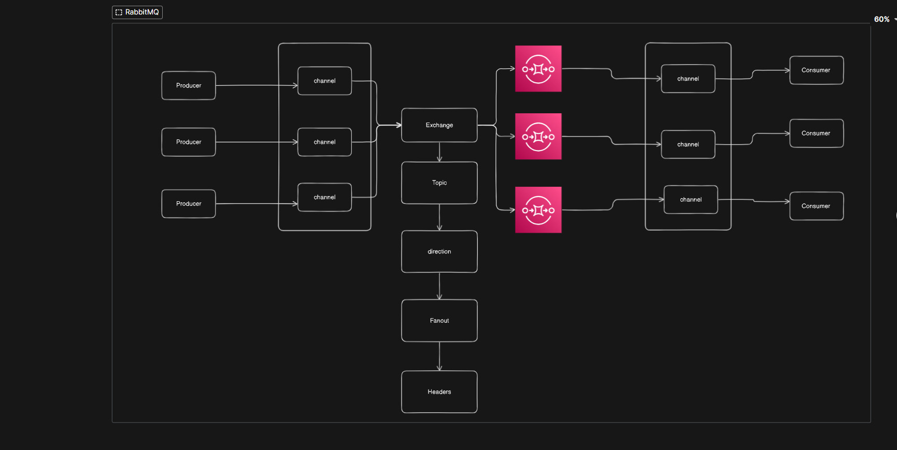
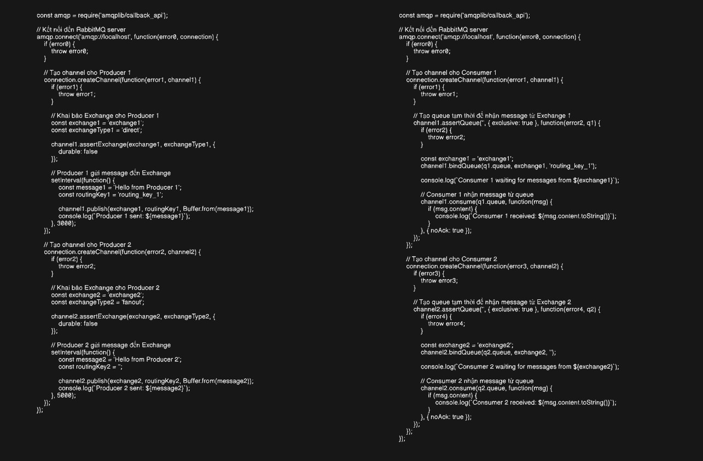

1) Chế độ ngang hàng

    +) Tin nhắn có thể được nhận từ nhiều khách hàng 

    +) Nhiều Producer có thể gửi thư vào 1 hàng đợi

2) Một hệ thống RabbiMQ có thể như hình sau  

    

3) Code 

    

3) Giải thích

    - Flow hoạt động:

        +) Producer trước khi nhắn event thì tạo 1 channel ( Kể cả consumer cũng vậy vì tất cả các giao tiếp sẽ qua channel )

        +) Sau khi tạo channel thì event sẽ được chuyển đến ExChange 
             
             *) Nói sơ qua exchange: Exchange bao gồm 4 loại:

                            Topic: Sử dụng các topic trong các event producer gửi đi vd order.one thì các queue kết nối với exchange order.* chẳng hạn sẽ nhận được

                            Direction: Sử dụng các Routing_key để xác minh cần gửi event đến queue nào ( routing key trong khi producer gửi đến exchange và routing key khi exchange binding với queue ) 

                            fanout: Gửi event cho tất cả các queue binding

                            header: Set header cho event và check xem header queue nào trùng
    

        +) Sau đó exchange sẽ gửi đến queue theo đúng lộ trình 

        +) Queue gửi đến channel của consumer xử lí

    - Một số lưu ý:
    
        Trong consumer buộc phải có một cơ chế xử lí message lạ tránh việc không thể xử lí message lạ dẫn đến đầy queue

        Set nhiều consumer cùng loại cùng xử lí một queue để giảm tải cho consumer tránh khả năng lỗi

        noAck: Nếu set là false thì các message sẽ không được xác nhận là đã được hoàn thành và bật chế độ kiểm soát tin nhắn nếu tin nhắn hoàn thành thì phải set  // Acknowledge message
        channel.ack(msg);

        một queue chỉ gửi message đến một consumer để xử lí nếu có nhiều consumer thì queue sẽ phân phát giảm tải cho consumer( Vậy nên để scale hệ thống chỗ này ta có thể triển khai nhiều consumer )

        duration - persisten: Khi crack RabbitMQ vẫn không mất message ( Không hoàn toàn đảm bảo vì mặc dù nó yêu cầu RabbitMQ lưu tin nhắn vào đĩa nhưng vẫn có một khoảng thời gian ngắn khi RabbitMQ đã chấp nhận tin nhắn và chưa lưu nó. Ngoài ra nó không thực hiện lưu vào đĩa toàn bộ tin nhắn nó có thể chỉ được lưu vào đệm mà không lưu vào đĩa )

        experionTime: THời gian tồn tại của một message nếu nó chưa được xử lí 

        channel.assertQueue(queueName, { durable: false, exclusive: true }, ); : Tuự động xóa queue sau khi close service

        Một channel producer chỉ có thể kết nối một exchange nhưng 1 queue có thể kết nối nhiều exchange

        🍒 Fair dispatch: Một điểm vô cùng quan trọng trong phân phối message cho các consumer là nó chỉ phân phối giống dạng chẳn lẽ tức là consumer1 nhận message 1 consumer 2 nhận message 2 chứ không dựa vào mức độ xử lí lâu của consumer. Để giải quyết vấn đề này ta sử dụng phương thức prefect có giá trị 1. Điều này yêu cầu RabbitMQ không gửi nhiều tin nhắn cho một nhân viên cùng một lúc. Hay nói cách khác không gửi tin nhắn mới cho một nhân viên cho đến khi nó xử lý và xác nhận tin nhắn trước đó. Thay vào đó nó sẽ gửi nó cho nhân viên tiếp theo không còn bận.

             => channel.prefetch(1);

        

